# Wazuh: övervakning av AD-labbet

Jag byggde en liten Windows-domän (`lab.local`) i Hyper-V och kopplade den till Wazuh-servern jag redan hade körande på Proxmox. Sedan skrev jag två egna regler och testade dem genom att göra sådant en angripare skulle göra. Allt som visas här är tester jag körde själv i labbet.

## Miljön

- **DC01**: Windows Server 2022 (Evaluation), domänkontrollant och DNS, statisk IP.
- **CLIENT01**: Windows 11 Enterprise (Evaluation), med i domänen, DNS pekar på DC01.
- **Wazuh-servern**: Ubuntu 24.04 som VM på Proxmox, samma LAN.

Domänen heter `lab.local` och har tre OU:er (`Lab-Users`, `Lab-Computers`, `Lab-Groups`) plus ett testkonto, `testuser`. Båda maskinerna kör Sysmon med SwiftOnSecuritys konfiguration. Hyper-V-switchen är kopplad till det fysiska nätverkskortet så att VM:arna når Wazuh på LAN.

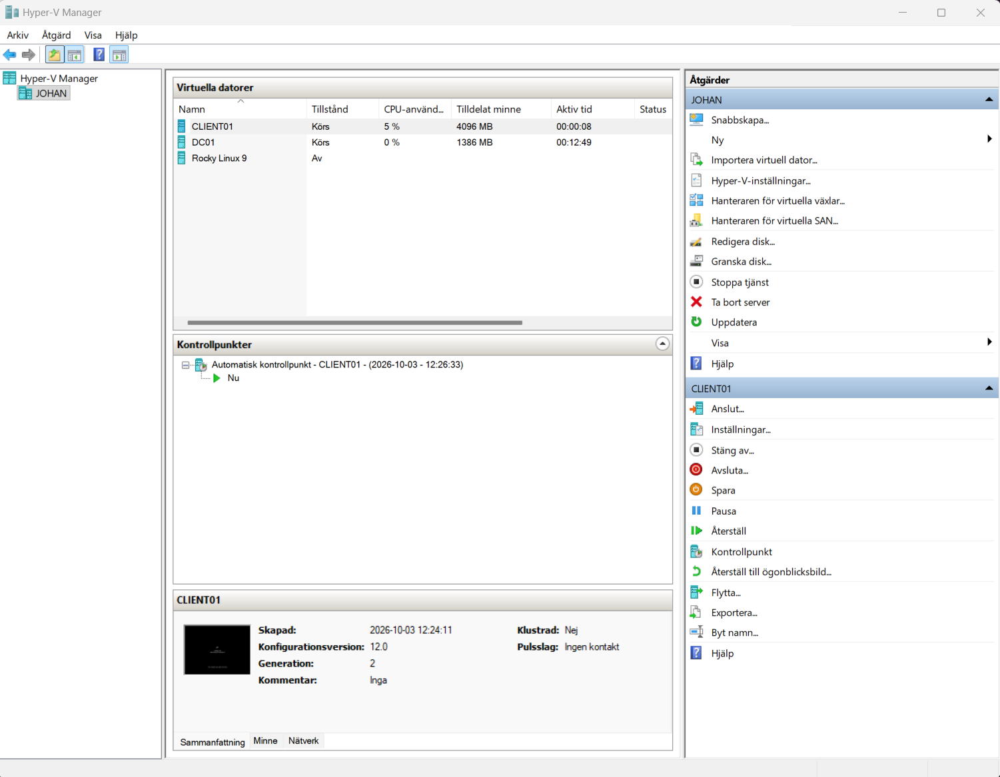


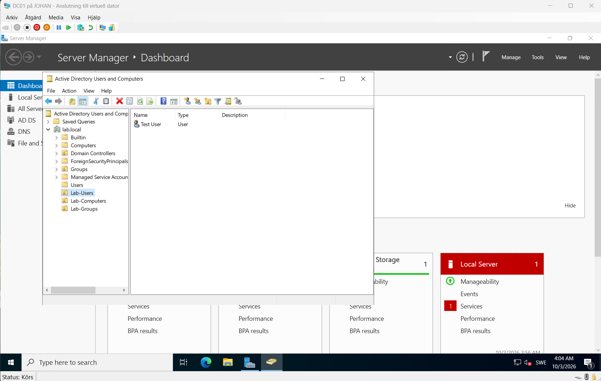
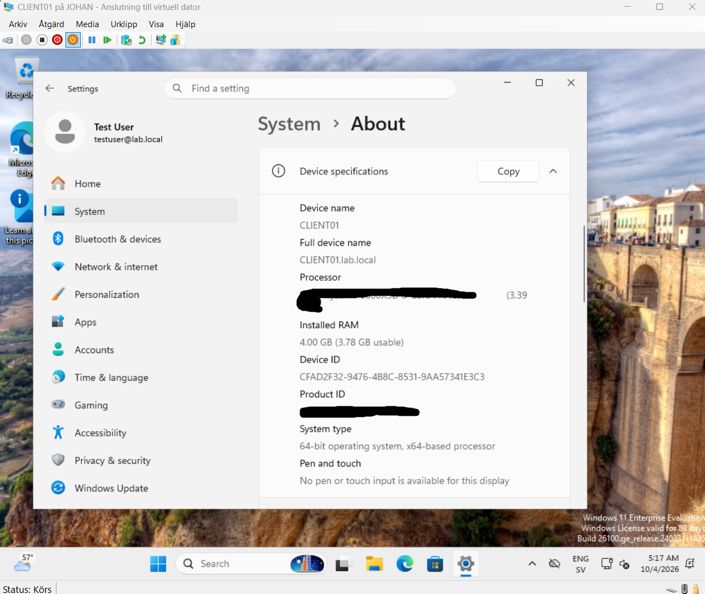

### Saker som gick fel

Det mesta strulade med nätverket, vilket i efterhand var lärorikt.

- **IP-krock.** Adressen jag först valde till DC01 användes redan av en fysisk enhet. Jag såg det på ARP-tabellen (MAC-adressen var inte Hyper-V:s) och på att pingsvaren hade TTL 64 i stället för 128. DC01 fick en annan, ledig adress.
- **Domänanslutningen vägrade.** CLIENT01 frågade routerns IPv6-DNS före DC01 och hittade därför aldrig domänen. Jag stängde av IPv6 på nätverkskortet.
- **Agenten kom inte ut på internet.** DC01:s DNS visste inte vart den skulle skicka frågor om externa namn, så nedladdningen från packages.wazuh.com föll. Jag lade in routern och 1.1.1.1 som forwarders.
- **"Duplicate agent name".** CLIENT01 låg kvar som en gammal post i Wazuh och blockerade ny registrering. Jag tog bort den med `DELETE /agents` i Wazuhs Dev Tools, och då registrerade agenten om sig.

## Agenterna

Wazuh-agenten (4.11.2) körs på båda maskinerna. Security-loggen samlas in som standard, men Sysmon-loggen får man lägga till själv. Jag la in det här i `ossec.conf` och startade om tjänsten:

```xml
<localfile>
  <location>Microsoft-Windows-Sysmon/Operational</location>
  <log_format>eventchannel</log_format>
</localfile>
```

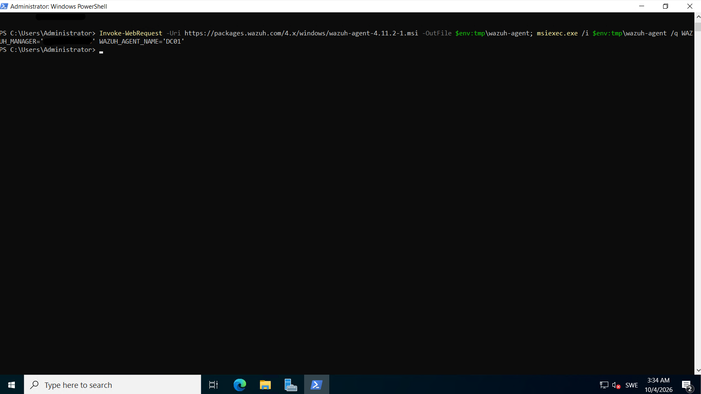
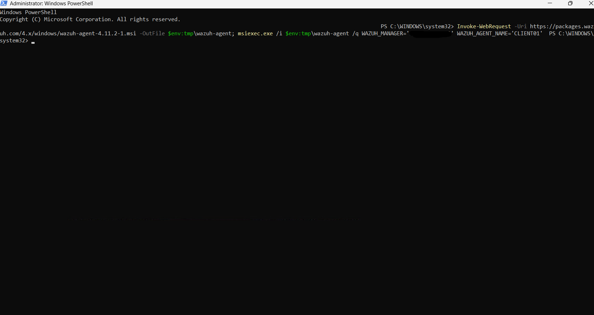
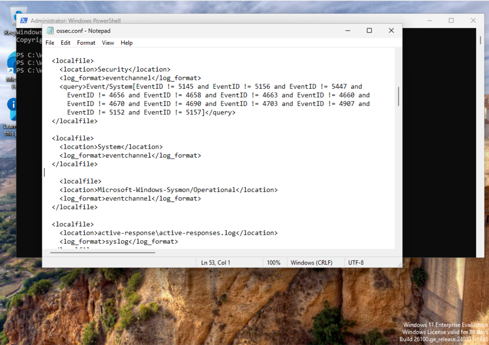
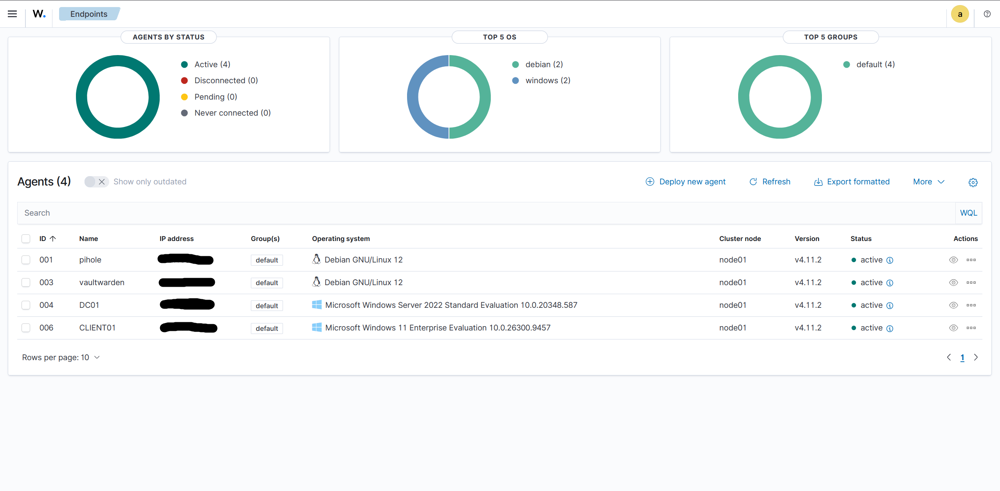

Sysmon installerades med `Sysmon64.exe -accepteula -i sysmonconfig-export.xml`.

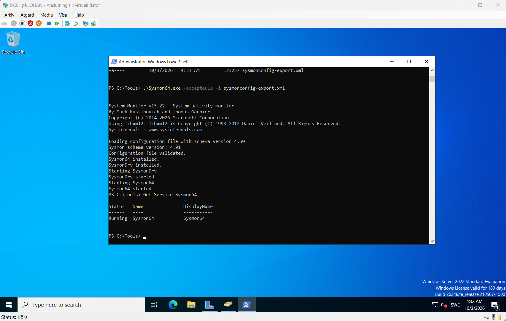
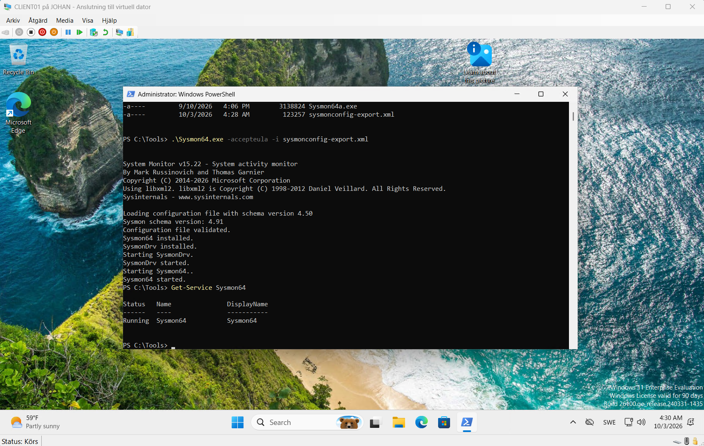
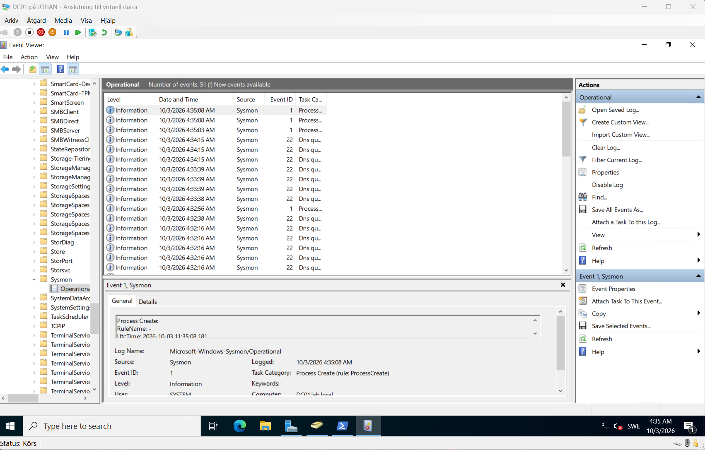

Innan jag installerade agenterna kollade jag att båda maskinerna nådde Wazuh på port 1514 (loggar) och 1515 (registrering).

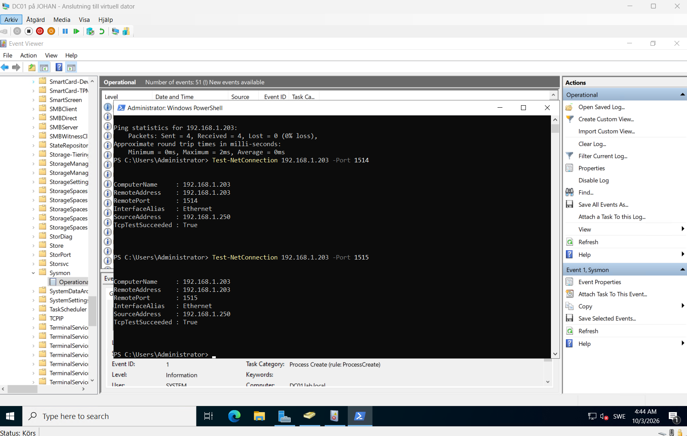
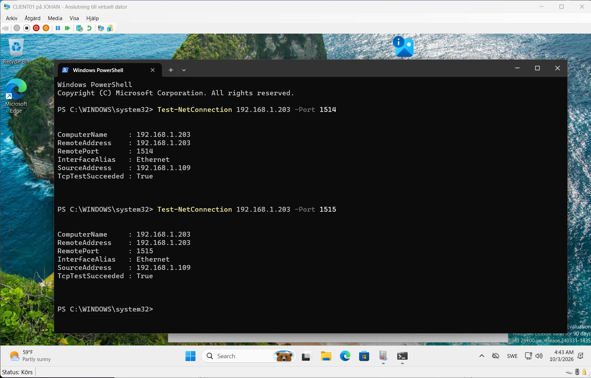

## Mina regler

De ligger i `/var/ossec/etc/rules/local_rules.xml`:

```xml
<group name="local,windows,">
  <rule id="100001" level="10" frequency="3" timeframe="300">
    <if_matched_sid>60122</if_matched_sid>
    <same_field>win.eventdata.targetUserName</same_field>
    <description>Brute force: 3+ misslyckade inloggningar mot samma konto på 5 min</description>
    <mitre><id>T1110</id></mitre>
  </rule>

  <rule id="100002" level="12">
    <if_group>windows</if_group>
    <field name="win.system.eventID">^1102$</field>
    <description>Säkerhetsloggen har rensats</description>
    <mitre><id>T1070.001</id></mitre>
  </rule>
</group>
```

Regel 100001 bygger på Wazuhs egen regel 60122 (misslyckad inloggning, event 4625) och räknar per kontonamn. Tre fel på fem minuter ger larm, så ett enstaka felskrivet lösenord gör inget. Den mappar mot MITRE T1110, Brute Force.

Regel 100002 larmar på event 1102, alltså att säkerhetsloggen har rensats. Jag satte den på level 12 eftersom det sällan finns en oskyldig förklaring till det på en klient. Den mappar mot T1070.001.

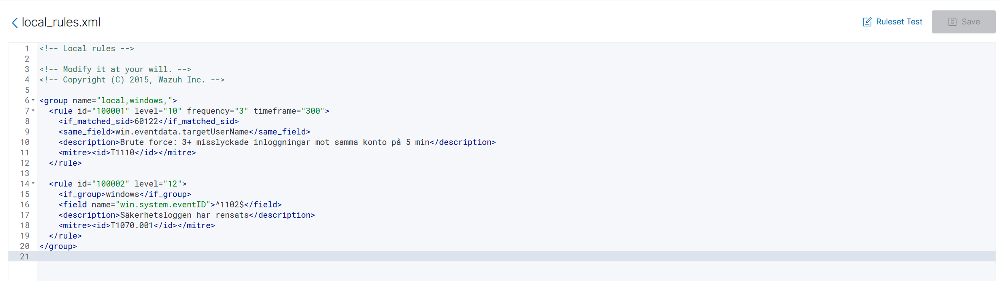

Larm på level 12 och uppåt skickas också till en Discord-kanal.

## Testerna

Allt kördes på CLIENT01 med verktyg som redan finns i Windows.

### Brute force

Jag gjorde fem felaktiga inloggningar mot det lokala kontot `labuser` med `net use \\localhost\IPC$ /user:labuser <fel lösenord>`. Windows loggade event 4625 varje gång, och Wazuh visade fem larm från regel 60122. Efter det tredje försöket slog min regel 100001 till. Sysmon fångade samtidigt själva `net.exe`-anropet (regel 92037), så samma sak syntes från två håll.

I verkligheten hade jag velat veta varifrån försöken kom, vilket konto det gällde och om en lyckad inloggning kom efteråt. Här var det mitt eget test.

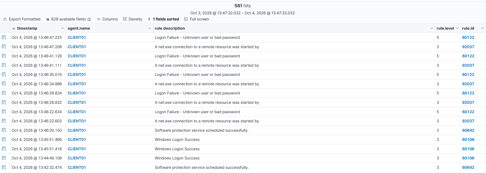
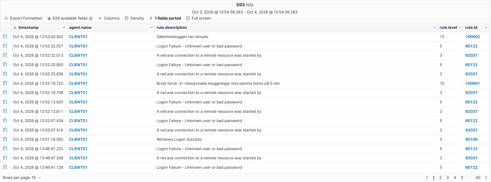

### Nytt adminkonto

Jag skapade kontot `labadmin` och lade det i administratörsgruppen:

```
net user labadmin <lösenord> /add
net localgroup administrators labadmin /add
```

Det gav "User account enabled or created" (60109, level 8) och "Administrators Group Changed" (60154, level 12). Det sista larmet kom också som Discord-notis. Ett nytt konto i administratörsgruppen som ingen känner till är något man alltid ska utreda, eftersom det är ett enkelt sätt att få kvar åtkomst.

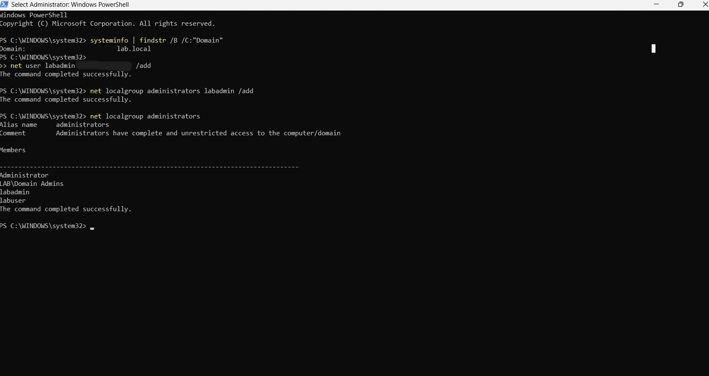
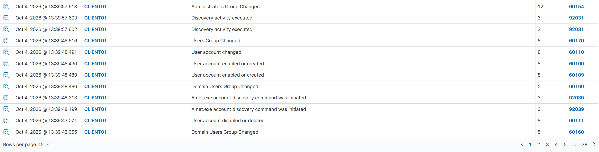

### Misstänkt process

Jag körde `cmd /c whoami /priv` från PowerShell. Wazuh gav larmet "Suspicious Windows cmd shell execution" (92032). I Sysmon-händelsen syns att `whoami.exe` startades av `cmd.exe` med kommandoraden `cmd.exe /c whoami /priv`, med hög integritetsnivå och användaren `CLIENT01\labuser`.

Ett ensamt `whoami /priv` behöver inte betyda något, administratörer gör det också. Det är kombinationen med vad som hände före och efter som avgör, men angripare använder det ofta direkt efter att de kommit in för att se vilka rättigheter de har.

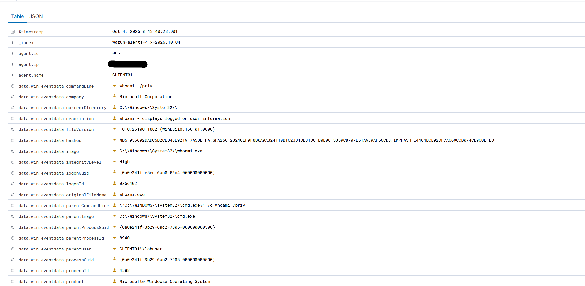

### Loggrensning

Sist körde jag `wevtutil cl Security`. Det gav event 1102 och larm från min regel 100002, plus en Discord-notis. Eftersom lokala loggar försvinner vid en rensning är det bra att Wazuh redan har skickat händelserna till servern.


### Ett falskt larm på level 15

Mitt i testerna kom det ett larm på level 15 (regel 92213) som även gick till Discord. Level 15 är högsta nivån, så jag utredde det innan jag gick vidare. Händelsen var att `msedge.exe` skrev en DLL-fil till en Temp-mapp, under användaren `LAB\testuser`. Regeln är tänkt att fånga skadlig kod som släpper en DLL på disk och startar den, men här var det Edges egen uppdaterare som packade upp sina filer. Jag kollade processen, sökvägen och användaren, och inget tydde på något annat än vanlig Edge-aktivitet. Alltså ett falsklarm.

Det jag tog med mig är att nivån på ett larm inte säger om det är på riktigt. Man måste titta på vad som faktiskt hände. I en riktig miljö hade jag skrivit en undantagsregel som sänker nivån för just det här mönstret, men bara för Edge och bara för den filtypen, så att jag inte gör mig blind för en angripare som använder samma mapp.

## Vad jag tar med mig

- Sysmon och Windows egna säkerhetsloggar kompletterar varandra. Samma `net use`-test syntes både som processkapning och som misslyckad inloggning.
- Agenten läser konfigurationen bara vid start, så ändringar i `ossec.conf` kräver omstart av tjänsten.
- En agent som ska registrera om sig under samma namn kräver att den gamla posten först tas bort på servern.
- I labbet fanns ingen kontoutlåsning. I en riktig miljö hade den begränsat brute force-försök.

## Nästa steg

- Skriva en regel för processkedjor som Wazuh inte täcker själv, till exempel `powershell.exe` som startar `cmd.exe`.
- Testa Active Response som låser kontot efter regel 100001.
- PKI-labbet (certifikatutfärdare och smartkortsinloggning).
